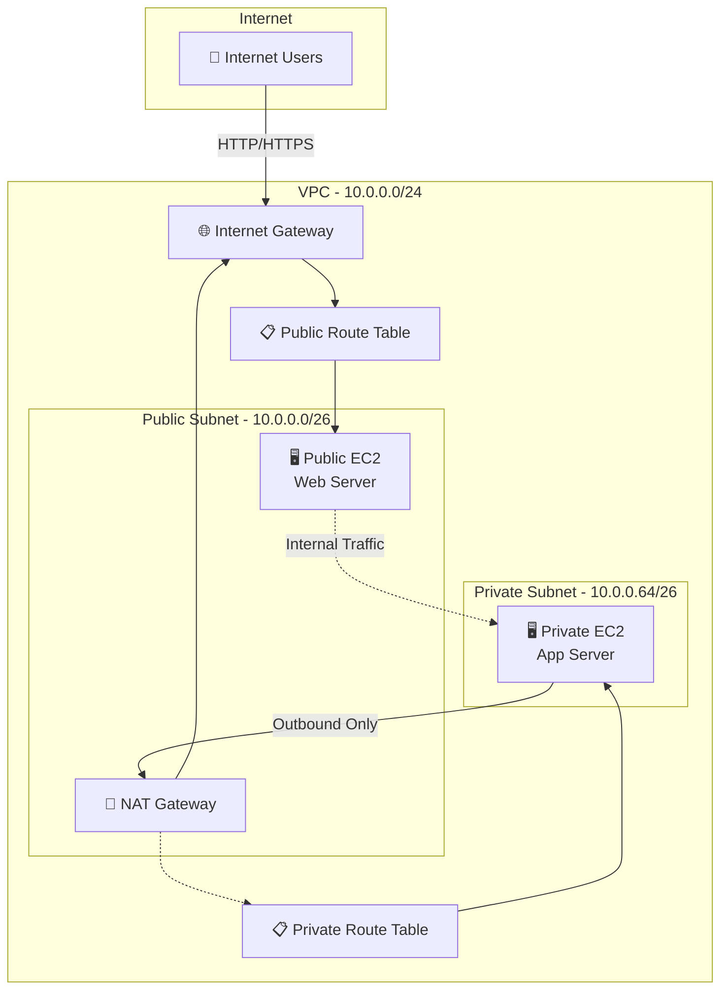
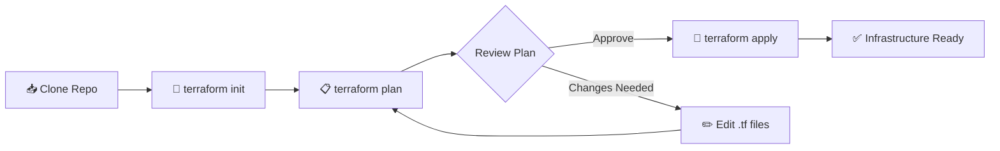

# 🏗️ Terraform AWS VPC Infrastructure

<div align="center">


[](LICENSE)

### 🎯 Production-Ready VPC Infrastructure as Code

**Automated, repeatable, and version-controlled AWS networking with Terraform**

[Architecture](#-architecture-overview) • [Quick Start](#-quick-start) • [Features](#-features) • [Modules](#-infrastructure-components)

</div>

---

## 🌟 Why This Project?

Building AWS infrastructure manually is **time-consuming**, **error-prone**, and **not reproducible**. This Terraform project solves that by providing:

<div align="center">

| 🚀 Fast Deployment | 🔄 Repeatable | 📝 Version Controlled | 💰 Cost Efficient |
|:------------------:|:-------------:|:---------------------:|:-----------------:|
| Deploy in **5 minutes** | Identical environments | Track all changes | Destroy when not needed |

</div>

---

## 📸 Architecture

Below is the network architecture of the VPC setup:

## 📐 Architecture Overview

### 🎨 Visual Network Design


This project uses **Terraform** to create a **VPC infrastructure** on AWS, including public and private subnets, Internet Gateway, NAT Gateway, route tables, security groups, and EC2 instances.


### 🔄 Traffic Flow Diagram



---

## ✨ Features

<table>
<tr>
<td width="50%">

### 🏗️ **Complete VPC Setup**
- ✅ Custom VPC with CIDR `10.0.0.0/24`
- ✅ Public subnet (`10.0.0.0/26`)
- ✅ Private subnet (`10.0.0.64/26`)
- ✅ Internet Gateway for public access
- ✅ NAT Gateway for private outbound

</td>
<td width="50%">

### 🔒 **Secure by Default**
- ✅ Isolated private subnet
- ✅ Security group rules
- ✅ No direct internet to private
- ✅ Principle of least privilege
- ✅ Encrypted state storage

</td>
</tr>
<tr>
<td width="50%">

### 🚀 **Infrastructure as Code**
- ✅ Terraform managed
- ✅ Version controlled
- ✅ Reproducible deployments
- ✅ S3 remote state backend
- ✅ DynamoDB state locking

</td>
<td width="50%">

### 💻 **Pre-configured Resources**
- ✅ Ubuntu EC2 instances
- ✅ Proper route tables
- ✅ Subnet associations
- ✅ Elastic IP for NAT
- ✅ Security groups

</td>
</tr>
</table>

---

## 📂 Project Structure

```
📦 terraform-vpc/
│
├── 📄 main.tf                      # Core infrastructure definitions
│   ├── VPC configuration
│   ├── Subnets (public & private)
│   ├── Internet & NAT Gateways
│   ├── Route tables & associations
│   ├── Security groups
│   └── EC2 instances
│
├── 📄 provider.tf                  # AWS provider configuration
│   ├── AWS region
│   ├── Provider version
│   └── Authentication
│
├── 📄 backend.tf                   # Remote state configuration
│   ├── S3 bucket for state
│   ├── DynamoDB for locking
│   └── Encryption settings
│
├── 📄 variables.tf                 # Input variables (create this)
├── 📄 outputs.tf                   # Output values (create this)
├── 📄 terraform.tfvars             # Variable values (gitignored)
│
├── 📁 outputs/                     # Architecture diagrams
│   └── architecture.jpg
│
├── 📁 .terraform/                  # Terraform plugins (gitignored)
├── 📄 .terraform.lock.hcl          # Provider version lock
├── 📄 terraform.tfstate            # Local state (gitignored)
├── 📄 terraform.tfstate.backup     # State backup (gitignored)
│
├── 📄 .gitignore                   # Git ignore rules
├── 📄 README.md                    # This file
└── 📄 LICENSE                      # MIT License
```

---

## 🚀 Quick Start

### Prerequisites Checklist

```bash
✅ Terraform v1.0+ installed
✅ AWS CLI configured with credentials
✅ Active AWS account
✅ Basic understanding of AWS VPC
✅ Git installed (optional)
```

### 📥 Installation Steps

<details open>
<summary><b>1️⃣ Install Terraform</b></summary>

**macOS:**
```bash
brew tap hashicorp/tap
brew install hashicorp/tap/terraform
```

**Ubuntu/Debian:**
```bash
wget -O- https://apt.releases.hashicorp.com/gpg | sudo gpg --dearmor -o /usr/share/keyrings/hashicorp-archive-keyring.gpg
echo "deb [signed-by=/usr/share/keyrings/hashicorp-archive-keyring.gpg] https://apt.releases.hashicorp.com $(lsb_release -cs) main" | sudo tee /etc/apt/sources.list.d/hashicorp.list
sudo apt update && sudo apt install terraform
```

**Verify:**
```bash
terraform version
```

</details>

<details>
<summary><b>2️⃣ Configure AWS CLI</b></summary>

```bash
# Install AWS CLI
curl "https://awscli.amazonaws.com/awscli-exe-linux-x86_64.zip" -o "awscliv2.zip"
unzip awscliv2.zip
sudo ./aws/install

# Configure credentials
aws configure
```

**Enter when prompted:**
```
AWS Access Key ID: YOUR_ACCESS_KEY
AWS Secret Access Key: YOUR_SECRET_KEY
Default region name: us-east-1
Default output format: json
```

</details>

<details open>
<summary><b>3️⃣ Clone & Deploy</b></summary>

```bash
# Clone repository
git clone https://github.com/sujalkamanna/terraform-vpc.git
cd terraform-vpc

# Initialize Terraform
terraform init

# Review execution plan
terraform plan

# Apply configuration
terraform apply
```

**Confirm with:** `yes`

**Deployment time:** ~3-5 minutes

</details>

---

## 🎯 Deployment Workflow

### Complete Deployment Process



---

## 🏗️ Infrastructure Components

### 🌐 VPC Configuration

```hcl
resource "aws_vpc" "main" {
  cidr_block           = "10.0.0.0/24"
  enable_dns_hostnames = true
  enable_dns_support   = true

  tags = {
    Name        = "terraform-vpc"
    Environment = "production"
    ManagedBy   = "terraform"
  }
}
```

**What you get:**
- 256 IP addresses (`10.0.0.0` - `10.0.0.255`)
- DNS resolution enabled
- DNS hostnames enabled
- Production-ready tagging

---

### 🌍 Subnet Layout

| Subnet Type | CIDR Block | IP Range | Available IPs | Purpose |
|-------------|-----------|----------|---------------|---------|
| **Public** | `10.0.0.0/26` | 10.0.0.0 - 10.0.0.63 | 59 | Web servers, bastion |
| **Private** | `10.0.0.64/26` | 10.0.0.64 - 10.0.0.127 | 59 | App servers, databases |

**Public Subnet:**
```hcl
resource "aws_subnet" "public" {
  vpc_id                  = aws_vpc.main.id
  cidr_block              = "10.0.0.0/26"
  availability_zone       = "us-east-1a"
  map_public_ip_on_launch = true

  tags = {
    Name = "public-subnet"
    Type = "public"
  }
}
```

**Private Subnet:**
```hcl
resource "aws_subnet" "private" {
  vpc_id            = aws_vpc.main.id
  cidr_block        = "10.0.0.64/26"
  availability_zone = "us-east-1a"

  tags = {
    Name = "private-subnet"
    Type = "private"
  }
}
```

---

### 🔐 Security Groups

**Public EC2 Security Group:**
```hcl
resource "aws_security_group" "public" {
  name        = "public-sg"
  description = "Security group for public EC2 instances"
  vpc_id      = aws_vpc.main.id

  ingress {
    description = "HTTP from Internet"
    from_port   = 80
    to_port     = 80
    protocol    = "tcp"
    cidr_blocks = ["0.0.0.0/0"]
  }

  ingress {
    description = "HTTPS from Internet"
    from_port   = 443
    to_port     = 443
    protocol    = "tcp"
    cidr_blocks = ["0.0.0.0/0"]
  }

  ingress {
    description = "SSH from Admin"
    from_port   = 22
    to_port     = 22
    protocol    = "tcp"
    cidr_blocks = ["YOUR_IP/32"]  # Replace with your IP
  }

  egress {
    description = "All outbound"
    from_port   = 0
    to_port     = 0
    protocol    = "-1"
    cidr_blocks = ["0.0.0.0/0"]
  }
}
```

**Private EC2 Security Group:**
```hcl
resource "aws_security_group" "private" {
  name        = "private-sg"
  description = "Security group for private EC2 instances"
  vpc_id      = aws_vpc.main.id

  ingress {
    description     = "All traffic from public subnet"
    from_port       = 0
    to_port         = 0
    protocol        = "-1"
    security_groups = [aws_security_group.public.id]
  }

  egress {
    description = "All outbound via NAT"
    from_port   = 0
    to_port     = 0
    protocol    = "-1"
    cidr_blocks = ["0.0.0.0/0"]
  }
}
```

---

### 🖥️ EC2 Instances

**Public EC2 (Web Server):**
```hcl
resource "aws_instance" "public" {
  ami                    = "ami-0c55b159cbfafe1f0"  # Ubuntu 20.04
  instance_type          = "t2.micro"
  subnet_id              = aws_subnet.public.id
  vpc_security_group_ids = [aws_security_group.public.id]
  key_name               = "your-key-pair"

  user_data = <<-EOF
              #!/bin/bash
              apt update -y
              apt install -y nginx
              systemctl start nginx
              systemctl enable nginx
              EOF

  tags = {
    Name = "public-web-server"
    Tier = "web"
  }
}
```

**Private EC2 (App Server):**
```hcl
resource "aws_instance" "private" {
  ami                    = "ami-0c55b159cbfafe1f0"  # Ubuntu 20.04
  instance_type          = "t2.micro"
  subnet_id              = aws_subnet.private.id
  vpc_security_group_ids = [aws_security_group.private.id]
  key_name               = "your-key-pair"

  tags = {
    Name = "private-app-server"
    Tier = "application"
  }
}
```

---

## 🔧 Configuration Files

### `variables.tf` (Recommended Addition)

```hcl
variable "aws_region" {
  description = "AWS region for resources"
  type        = string
  default     = "us-east-1"
}

variable "vpc_cidr" {
  description = "CIDR block for VPC"
  type        = string
  default     = "10.0.0.0/24"
}

variable "public_subnet_cidr" {
  description = "CIDR block for public subnet"
  type        = string
  default     = "10.0.0.0/26"
}

variable "private_subnet_cidr" {
  description = "CIDR block for private subnet"
  type        = string
  default     = "10.0.0.64/26"
}

variable "availability_zone" {
  description = "Availability zone"
  type        = string
  default     = "us-east-1a"
}

variable "instance_type" {
  description = "EC2 instance type"
  type        = string
  default     = "t2.micro"
}

variable "key_name" {
  description = "SSH key pair name"
  type        = string
  default     = "your-key-pair"
}

variable "environment" {
  description = "Environment name"
  type        = string
  default     = "production"
}
```

### `outputs.tf` (Recommended Addition)

```hcl
output "vpc_id" {
  description = "VPC ID"
  value       = aws_vpc.main.id
}

output "public_subnet_id" {
  description = "Public subnet ID"
  value       = aws_subnet.public.id
}

output "private_subnet_id" {
  description = "Private subnet ID"
  value       = aws_subnet.private.id
}

output "internet_gateway_id" {
  description = "Internet Gateway ID"
  value       = aws_internet_gateway.igw.id
}

output "nat_gateway_id" {
  description = "NAT Gateway ID"
  value       = aws_nat_gateway.nat.id
}

output "public_ec2_ip" {
  description = "Public EC2 instance public IP"
  value       = aws_instance.public.public_ip
}

output "private_ec2_ip" {
  description = "Private EC2 instance private IP"
  value       = aws_instance.private.private_ip
}

output "public_security_group_id" {
  description = "Public security group ID"
  value       = aws_security_group.public.id
}

output "private_security_group_id" {
  description = "Private security group ID"
  value       = aws_security_group.private.id
}
```

---

## 💾 Remote State Backend

### S3 + DynamoDB Configuration

**`backend.tf`:**
```hcl
terraform {
  backend "s3" {
    bucket         = "terraform-state-bucket-unique-name"
    key            = "vpc/terraform.tfstate"
    region         = "us-east-1"
    encrypt        = true
    dynamodb_table = "terraform-state-lock"
  }
}
```

### Setup Backend Resources

```bash
# Create S3 bucket
aws s3api create-bucket \
    --bucket terraform-state-bucket-unique-name \
    --region us-east-1

# Enable versioning
aws s3api put-bucket-versioning \
    --bucket terraform-state-bucket-unique-name \
    --versioning-configuration Status=Enabled

# Enable encryption
aws s3api put-bucket-encryption \
    --bucket terraform-state-bucket-unique-name \
    --server-side-encryption-configuration '{
        "Rules": [{
            "ApplyServerSideEncryptionByDefault": {
                "SSEAlgorithm": "AES256"
            }
        }]
    }'

# Create DynamoDB table
aws dynamodb create-table \
    --table-name terraform-state-lock \
    --attribute-definitions AttributeName=LockID,AttributeType=S \
    --key-schema AttributeName=LockID,KeyType=HASH \
    --provisioned-throughput ReadCapacityUnits=5,WriteCapacityUnits=5 \
    --region us-east-1
```

---

## 📊 Terraform Commands Reference

### Essential Commands

```bash
# Initialize (first time)
terraform init

# Validate syntax
terraform validate

# Format code
terraform fmt

# Plan changes (dry run)
terraform plan

# Plan with variable file
terraform plan -var-file="prod.tfvars"

# Apply changes
terraform apply

# Apply without confirmation
terraform apply -auto-approve

# Show current state
terraform show

# List resources
terraform state list

# Destroy specific resource
terraform destroy -target=aws_instance.public

# Destroy everything
terraform destroy -auto-approve

# Refresh state
terraform refresh

# Import existing resource
terraform import aws_instance.example i-1234567890abcdef0

# Output values
terraform output

# Specific output
terraform output vpc_id

# Unlock state (if locked)
terraform force-unlock LOCK_ID
```

---

## 💰 Cost Estimation

### Monthly Cost Breakdown (us-east-1)

| Resource | Configuration | Monthly Cost |
|----------|--------------|--------------|
| **VPC** | Free tier | $0 |
| **Subnets** | Free | $0 |
| **Internet Gateway** | Free | $0 |
| **NAT Gateway** | 1 NAT Gateway | ~$32 |
| **Elastic IP** | 1 EIP (attached) | $0 |
| **EC2 Public** | t2.micro (on-demand) | ~$8.50 |
| **EC2 Private** | t2.micro (on-demand) | ~$8.50 |
| **EBS Volumes** | 2x 8GB gp2 | ~$1.60 |
| **Data Transfer** | 10GB NAT | ~$0.90 |
| **TOTAL** | | **~$51.50/month** |

### 💡 Cost Optimization

```hcl
# Use spot instances for non-critical workloads
resource "aws_instance" "private" {
  instance_market_options {
    market_type = "spot"
    spot_options {
      max_price = "0.01"
    }
  }
}

# Delete NAT Gateway in dev environments
# Access private instances via bastion instead
```

---

## 🐛 Troubleshooting

<details>
<summary><b>Error: Backend initialization failed</b></summary>

**Problem:** S3 bucket or DynamoDB table doesn't exist

**Solution:**
```bash
# Create backend resources first
aws s3 mb s3://terraform-state-bucket-unique-name
aws dynamodb create-table --table-name terraform-state-lock ...

# Or use local backend temporarily
# Comment out backend.tf and run:
terraform init -migrate-state
```

</details>

<details>
<summary><b>Error: Invalid AMI ID</b></summary>

**Problem:** AMI not available in your region

**Solution:**
```bash
# Find Ubuntu 20.04 AMI for your region
aws ec2 describe-images \
    --owners 099720109477 \
    --filters "Name=name,Values=ubuntu/images/hvm-ssd/ubuntu-focal-20.04-amd64-server-*" \
    --query 'Images[0].ImageId' \
    --region us-east-1

# Update main.tf with correct AMI
```

</details>

<details>
<summary><b>Error: State lock timeout</b></summary>

**Problem:** Previous Terraform run didn't release lock

**Solution:**
```bash
# Get lock ID from error message
terraform force-unlock LOCK_ID

# Verify no other Terraform processes running
ps aux | grep terraform
```

</details>

<details>
<summary><b>Can't SSH to private instance</b></summary>

**Solution:**
```bash
# SSH through public instance (bastion)
ssh -i key.pem ubuntu@PUBLIC_IP

# From public instance
ssh ubuntu@PRIVATE_IP

# Or use AWS Systems Manager Session Manager (no SSH needed)
```

</details>

---

## 🎓 Best Practices

### ✅ Do's

- ✅ Use **remote state** (S3) for team collaboration
- ✅ Enable **state locking** (DynamoDB) to prevent conflicts
- ✅ Use **variables** for reusable values
- ✅ Add **tags** to all resources
- ✅ Use **modules** for larger projects
- ✅ Run `terraform plan` before `apply`
- ✅ Use **.gitignore** for sensitive files
- ✅ Enable **versioning** on S3 state bucket
- ✅ Use **workspaces** for multiple environments

### ❌ Don'ts

- ❌ Don't commit `.tfstate` files to Git
- ❌ Don't commit `.tfvars` with secrets
- ❌ Don't manually edit state files
- ❌ Don't use `destroy -auto-approve` in production
- ❌ Don't hardcode sensitive values
- ❌ Don't skip `terraform plan`
- ❌ Don't run multiple applies simultaneously

---

## 📚 Learning Resources

| Topic | Resource | Level |
|-------|----------|-------|
| **Terraform Basics** | [HashiCorp Learn](https://learn.hashicorp.com/terraform) | Beginner |
| **AWS VPC** | [AWS VPC Guide](https://docs.aws.amazon.com/vpc/) | Beginner |
| **Terraform AWS Provider** | [Provider Docs](https://registry.terraform.io/providers/hashicorp/aws/latest/docs) | Intermediate |
| **State Management** | [Terraform State](https://www.terraform.io/docs/language/state/index.html) | Advanced |
| **Best Practices** | [Terraform Style Guide](https://www.terraform.io/docs/language/syntax/.html) | All Levels |

---

## 🚀 Next Steps

### Extend This Project

1. **Add More Availability Zones**
   ```hcl
   # Create subnets in multiple AZs
   resource "aws_subnet" "public_az2" {
     availability_zone = "us-east-1b"
     # ...
   }
   ```

2. **Add Application Load Balancer**
   ```hcl
   resource "aws_lb" "web" {
     name               = "web-alb"
     load_balancer_type = "application"
     subnets            = [aws_subnet.public.id, aws_subnet.public_az2.id]
   }
   ```

3. **Add Auto Scaling Group**
   ```hcl
   resource "aws_autoscaling_group" "web" {
     desired_capacity = 2
     max_size         = 4
     min_size         = 1
     # ...
   }
   ```

4. **Add RDS Database**
   ```hcl
   resource "aws_db_instance" "main" {
     engine         = "mysql"
     instance_class = "db.t3.micro"
     multi_az       = true
     # ...
   }
   ```

---

## 📜 License

**MIT License** - Free to use, modify, and distribute.

```
Copyright (c) 2024 Sujal Kamanna

Permission is hereby granted, free of charge...
```

📄 [Full License](LICENSE)

---

## 👨‍💻 Author

<div align="center">

**Sujal Kamanna**  
*DevOps & Cloud Engineer*

[](https://linkedin.com/in/sujalkamanna)
[](https://github.com/sujalkamanna)
[](https://registry.terraform.io/)

</div>

---

## 🙏 Acknowledgments

- **HashiCorp** for Terraform
- **AWS** for cloud infrastructure
- **Terraform community** for modules and best practices

---

## 📊 Project Stats

<div align="center">


</div>

---

<div align="center">

### ⭐ Star this repo if Terraform IaC helped you!

**Built with ❤️ using Infrastructure as Code**

---

**[⬆ Back to Top](#%EF%B8%8F-terraform-aws-vpc-infrastructure)**

</div>
