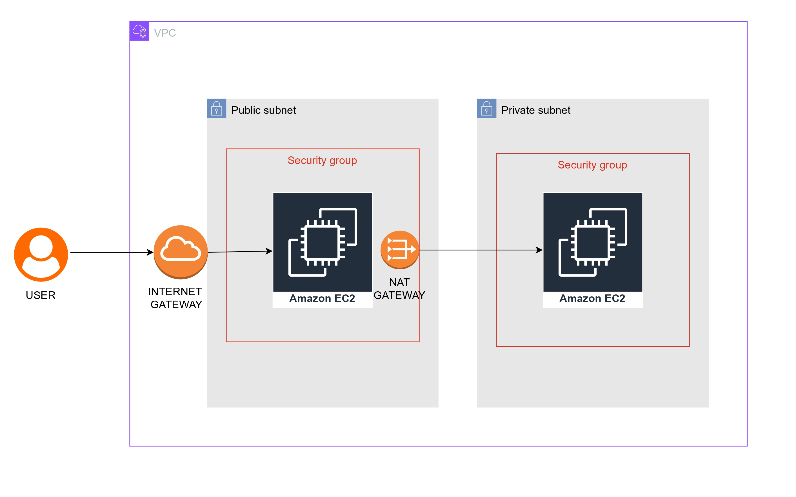

# Terraform VPC Project

## 📸 Architecture

Below is the network architecture of the VPC setup:



---

This project uses **Terraform** to create a **VPC infrastructure** on AWS, including public and private subnets, Internet Gateway, NAT Gateway, route tables, security groups, and EC2 instances.

---

## 📂 Project Structure

```

vpc/
├── main.tf              # Core Terraform configuration for VPC, subnets, NAT, IGW, route tables, and EC2
├── provider.tf          # AWS provider configuration
├── backend.tf           # Terraform backend configuration (S3 + DynamoDB for state and locking)
├── outputs/             # Contains images for architecture and network diagrams
├── .terraform/          # Terraform provider and plugin files (ignore in Git)
├── .terraform.lock.hcl  # Provider version lock file
├── terraform.tfstate    # Terraform state file (ignore in Git)
├── terraform.tfstate.backup
├── .gitignore
└── LICENSE

````

---

## ⚡ Features

- Creates a **VPC** with CIDR block `10.0.0.0/24`
- Configures **public and private subnets**
- Creates **Internet Gateway** and **NAT Gateway**
- Configures **route tables** and **associations** for public/private traffic
- Sets up **security groups** for public and private EC2 instances
- Launches **public and private EC2 instances**
- Backend support using **S3 bucket** and **DynamoDB table** for state storage and locking

---

## 🚀 Prerequisites

- [Terraform](https://www.terraform.io/downloads)
- AWS CLI configured with proper credentials
- An AWS account

---

## ⚙️ Setup Instructions

1. Clone the repository:

```bash
git clone https://github.com/<username>/<repo>.git
cd "vpc"
````

2. Initialize Terraform:

```bash
terraform init
```

3. Plan the changes:

```bash
terraform plan
```

4. Apply the configuration:

```bash
terraform apply
```

5. To destroy all resources:

```bash
terraform destroy -auto-approve
```

> **Note:** If using S3 backend and bucket is missing, configure Terraform to use local state or recreate the bucket.

---

## ⚠️ Important Notes

* **S3 Backend:** Stores the `terraform.tfstate` file. Make sure the bucket exists if using remote state.
* **DynamoDB Table:** Used for state locking to prevent concurrent Terraform runs.
* EC2 instances are based on Ubuntu AMI. Update the AMI ID in `main.tf` if needed.
* Always delete resources in proper order if destroying manually.

---

## 📄 License

This project is licensed under the MIT License. See [LICENSE](./LICENSE) for details.

---

### **Recommended `.gitignore`**

```gitignore
# Terraform files to ignore
.terraform/
*.tfstate
*.tfstate.backup
*.tfvars
.terraform.lock.hcl

# OS files
.DS_Store
Thumbs.db

# Logs
*.log
````
---
